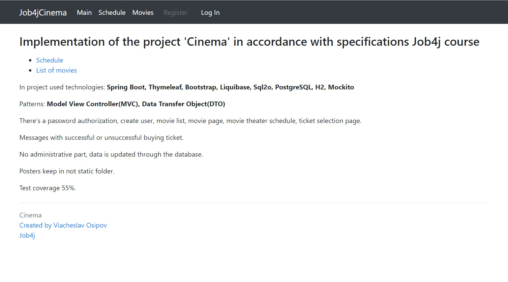
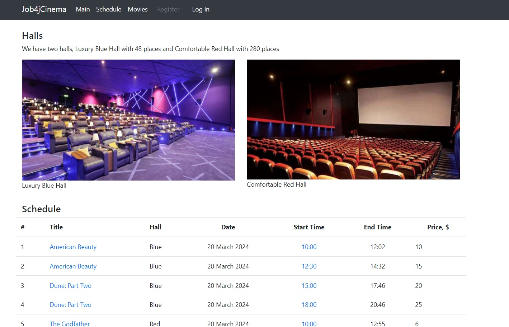
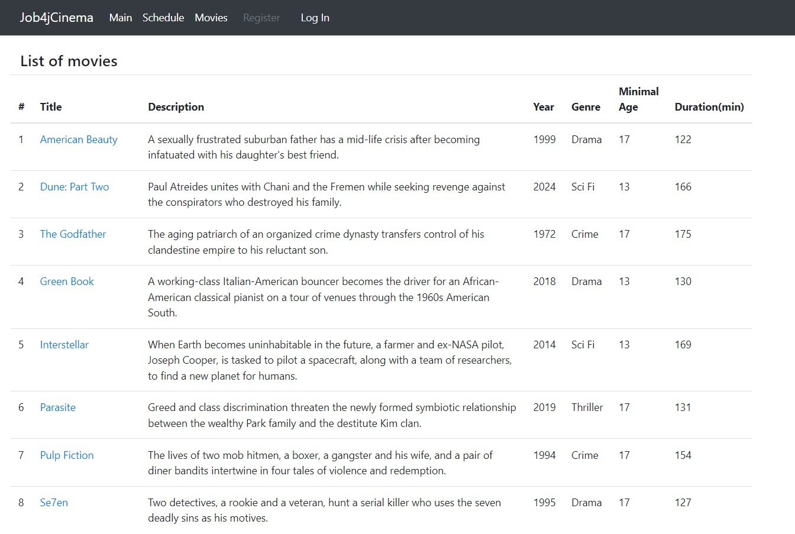
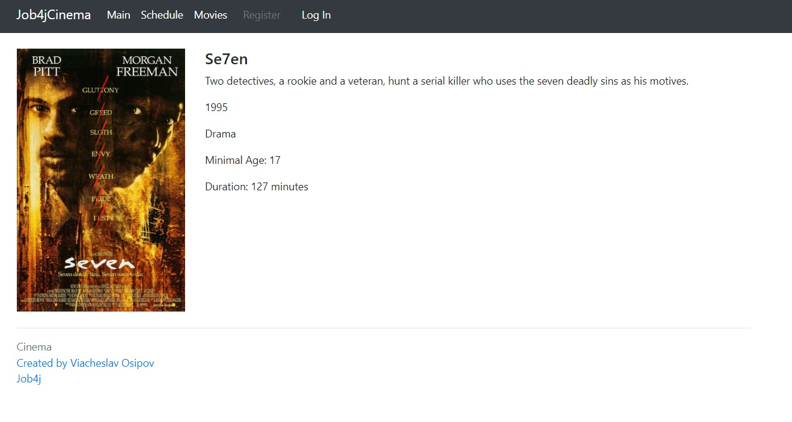
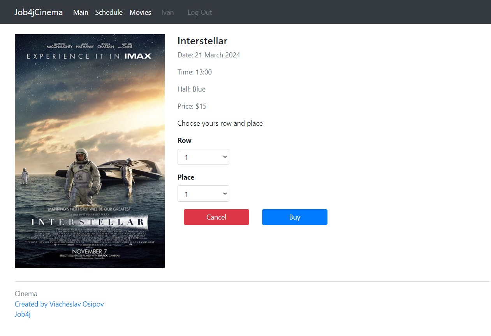
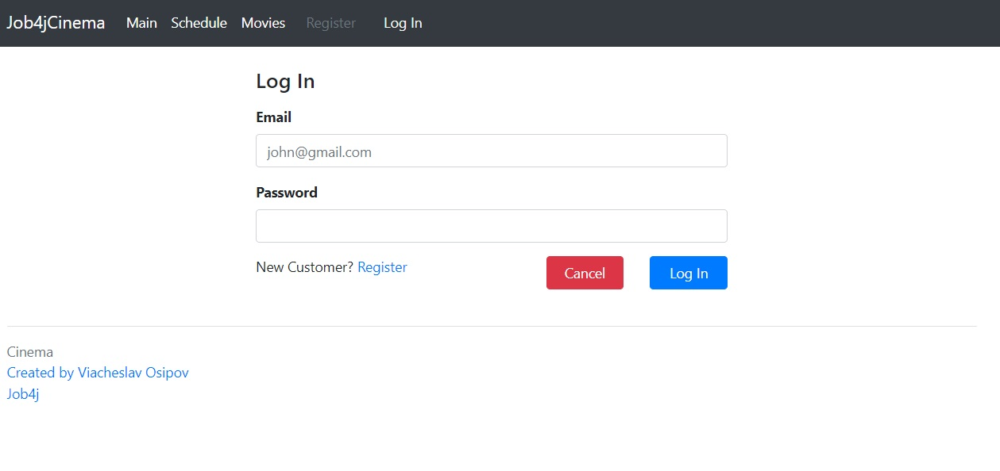
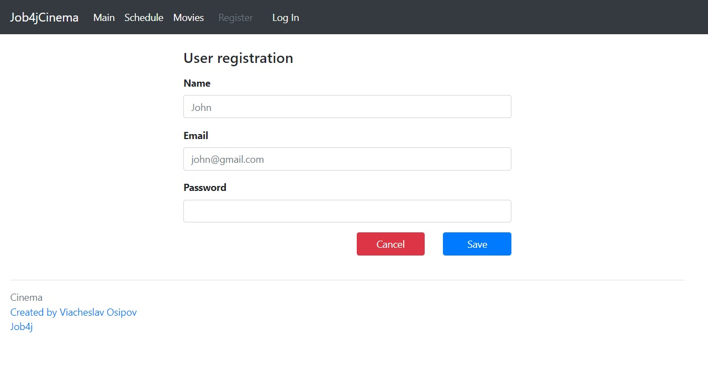
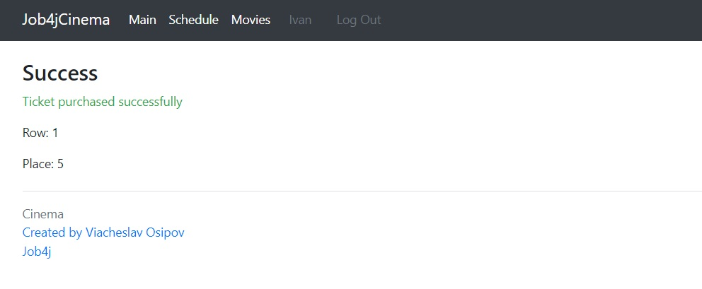

# job4j_cinema
## Project on course job4j.ru
### Description
* In project implement cinema shop with Movies List, Schedule Movie Sessions, Film Page.
Registration and Login pages. 
* For authorized user accessible buying tickets. Successfully or not notification.
* No administrative part, data is updated through the database.
* Posters keep in not static folder.

### Technologies
Spring Boot, Thymeleaf, Bootstrap, Liquibase, Sql2o, PostgreSQL, H2, Mockito

### Patterns
Model View Controller(MVC), Data Transfer Object(DTO)

### Environment
Java 17, Maven 3.9.2, PostgreSql 16

### Running project
SQL scripts for create tables and insert data: 
* /db/scripts/create_tables.sql
* /db/scripts/insert_tables.sql

Credentials:
* /db/liquibase.properties

### Author
Viacheslav Osipov  
[slavaosipov1199@gmail.com](mailto:slavaosipov1199@gmail.com)  
[LinkedIn](https://www.linkedin.com/in/viacheslav-osipov-67806ab3/)

### Screenshots

